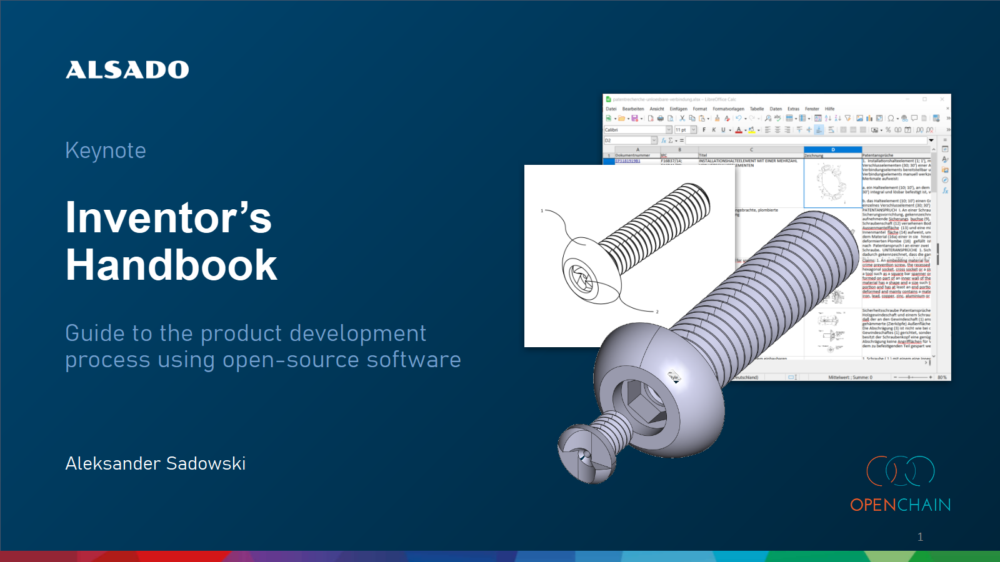

# documents
- Inventor’s Handbook - Guide to the product development process using open source software
- FreeCAD - Open-Source-CAD-Software für KMUs im Maschinenbau
- Produktentstehungsprozess im Maschinenbau mit Open-Source-Software

  
## Brochures

  

